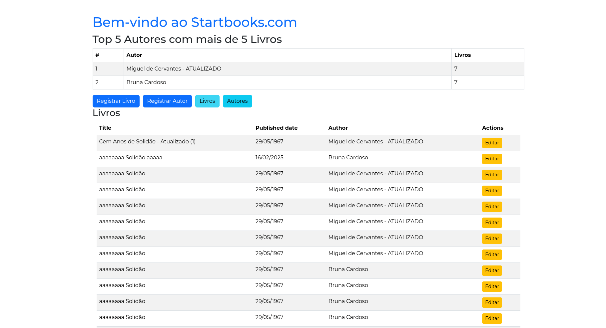
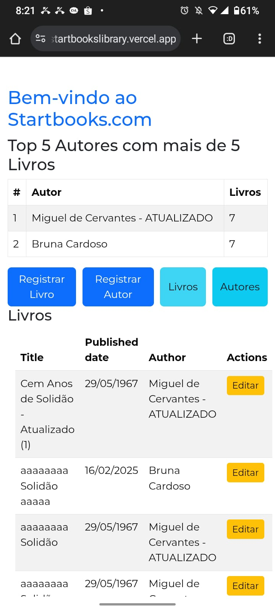

# StartBooks Library 📚


StartBooks Library é uma plataforma para gerenciar livros e autores de forma eficiente, permitindo o cadastro, edição e listagem de livros e seus respectivos autores.

## 🌍 Acesse o Projeto Online
🔗 [StartBooks Library](https://startbookslibrary.vercel.app/)


## 📸 Imagens do Projeto

<div style="display: flex; gap: 16px;">
  
  
</div>


## 🚀 Tecnologias Utilizadas

- Vue.js
- Vite
- Pinia
- Bootstrap
- Websocket
  

## 📦 Como Rodar o Projeto

### 1️⃣ Clonar o Repositório
```bash
git clone https://github.com/BrunaCardoso7/startbooks-library.git
```

### 2️⃣ Acessar a Pasta do Projeto
```bash
cd startbooks-library
```

### 3️⃣ Instalar as Dependências
```bash
npm install
# ou
yarn install
```

### 4️⃣ Rodar o Projeto
```bash
npm run dev
# ou
yarn dev
```

O projeto estará disponível em `http://localhost:5173/` por padrão.
